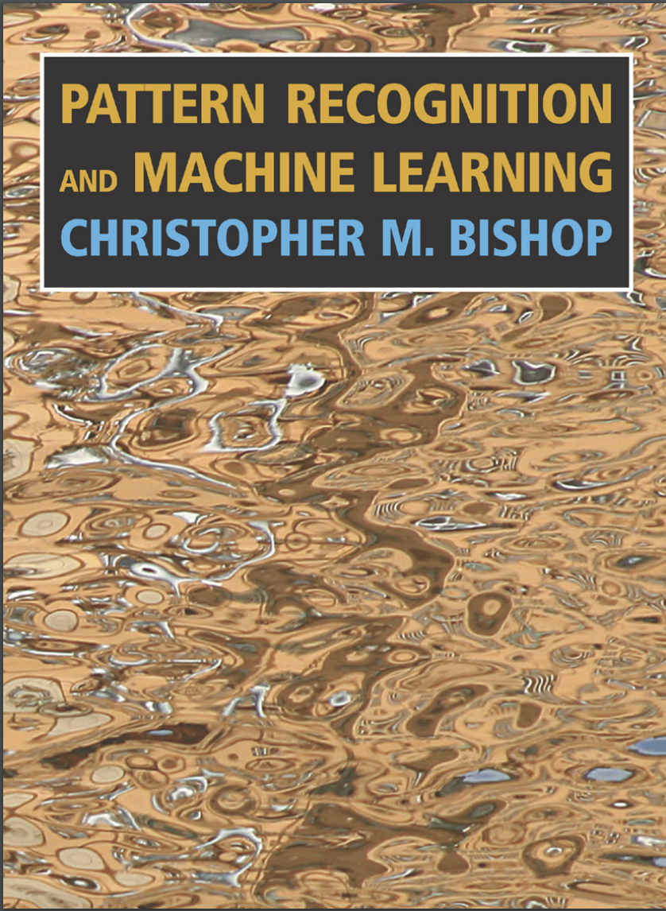
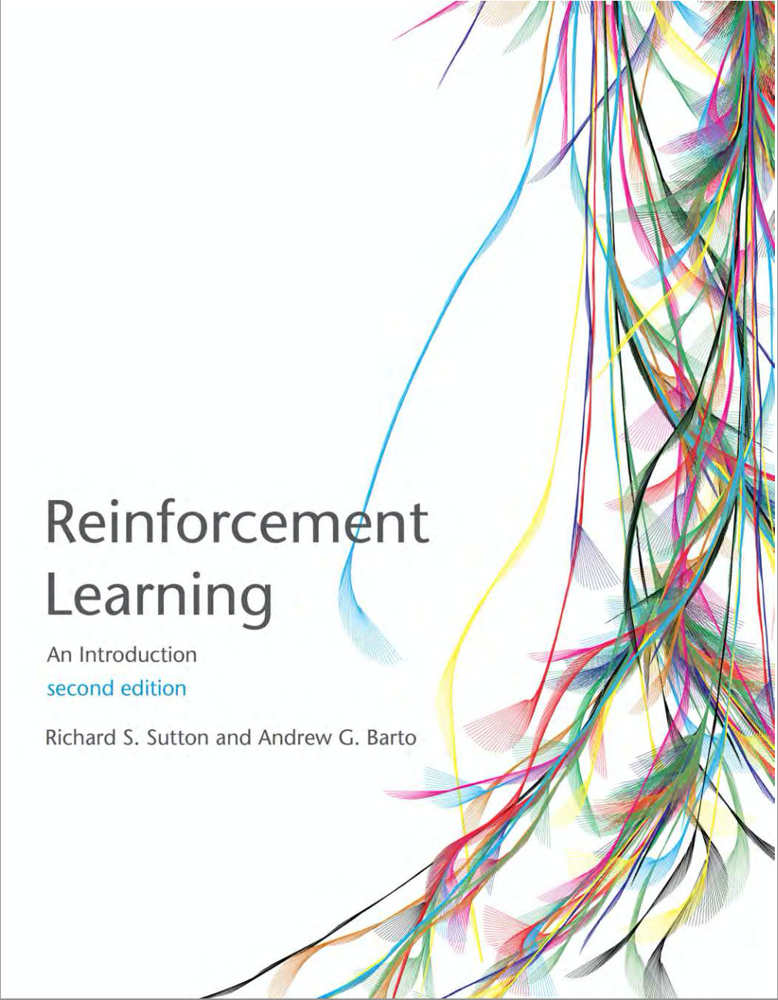

# MACHINE LEARNING NOTES

```diff
! please open all the notebooks with Colab since seems that GitHub has problem in visualizing long equations and didn't print them
```

<p align="center">

</p>

This repo is intended to assemble a collection of Colab Notebooks of the course Machine Learning (097683) given by Professor Marcello Restelli at Politecnico di Milano. The material is a reworking of the slides provided by the professor, his lessons and some supplementary material from the book ["Pattern Recognition and Machine Learning"](http://users.isr.ist.utl.pt/~wurmd/Livros/school/Bishop%20-%20Pattern%20Recognition%20And%20Machine%20Learning%20-%20Springer%20%202006.pdf) by Bishop and ["Reinforcement Learning: An Introduction"](https://web.stanford.edu/class/psych209/Readings/SuttonBartoIPRLBook2ndEd.pdf) by Sutton & Barto.

<p align="center">
   
</p>

# Table of Contents
 1. [Introduction](lectures/00_Introduction.ipynb)
    * Ovierview of Supervised Learning
 2. [Linear Models for Regression](lectures/01_Linear_Models_for_Regression.ipynb)
    * Linear Models
    * Minimizing Least Squares
    * Regularization
    * Bayesian Linear Regression
 3. [Linear Models for Classifications](lectures/02_Linear_Models_for_Classifications.ipynb)

The main idea is to continuously update this bunch of notes with papers and codes. If anyone wants to contribute (review, pictures, equations, ecc..) is more than welcome :beer:

My contact: stefanofrancesco.pitton@polimi.it
