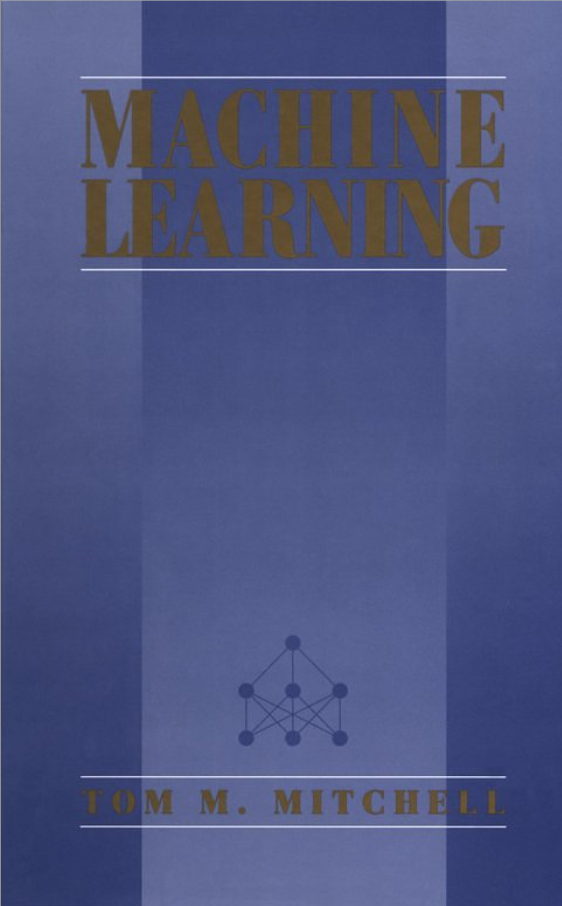
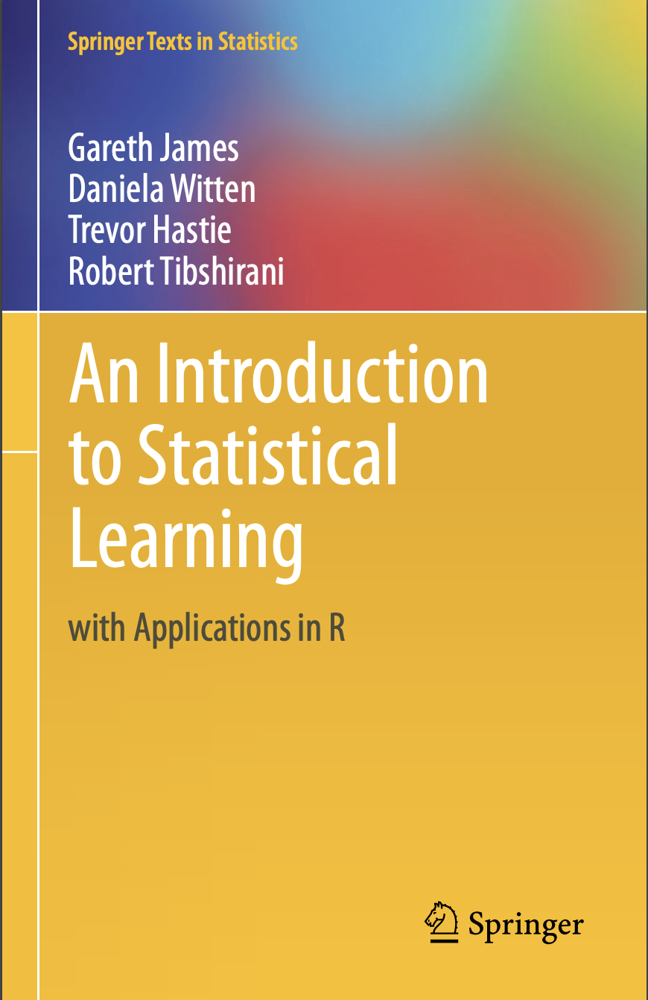

# MACHINE LEARNING NOTES

```diff
! please open all the notebooks with Colab since seems that GitHub has problem in visualizing long equations and didn't print them
```

<p align="center">

</p>

This repo is intended to assemble a collection of Colab Notebooks of the course Machine Learning (097683) given by Professor [Marcello Restelli](http://home.deib.polimi.it/restelli/MyWebSite/teaching.shtml) at Politecnico di Milano. The material is a reworking of the slides provided by the professor, his lessons, slides of professor [Daniele Loiacono](http://home.deib.polimi.it/loiacono/) and some supplementary material from the book ["Pattern Recognition and Machine Learning"](http://users.isr.ist.utl.pt/~wurmd/Livros/school/Bishop%20-%20Pattern%20Recognition%20And%20Machine%20Learning%20-%20Springer%20%202006.pdf) by Bishop, ["An Introduction to Statistical Learning"](https://faculty.marshall.usc.edu/gareth-james/ISL/ISLR%20Seventh%20Printing.pdf) by James, Witten, Hastie & Tibshirani, ["Machine Learning"](http://profsite.um.ac.ir/~monsefi/machine-learning/pdf/Machine-Learning-Tom-Mitchell.pdf) by Mitchel and ["Reinforcement Learning: An Introduction"](https://web.stanford.edu/class/psych209/Readings/SuttonBartoIPRLBook2ndEd.pdf) by Sutton & Barto.

<p align="center">
   
</p>

<p align="center">
   
</p>
 
# Table of Contents
 1. [Introduction](lectures/00_Introduction.ipynb)
    * Ovierview of Supervised Learning
 2. [Linear Models for Regression](lectures/01_Linear_Models_for_Regression.ipynb)
    * Linear Models
    * Minimizing Least Squares
    * Regularization
    * Bayesian Linear Regression
 3. [Linear Models for Classification](lectures/02_Linear_Models_for_Classification.ipynb)
    * Linear Classification
    * Discriminant Functions
    * Probabilistic Discriminative Approach
 4. [Bias-Variance and Model Selection](lectures/03_Bias_Variance_and_Model_Selection.ipynb)
    * No Free-Lunch Theorems
    * Bias-Variance Trade-off
    * Curse of Dimensionality
    * Feature Selection
    * Shrinkage
    * Dimensionality Reduction
    * Bagging and Boosting
 5. [PAC-learning and VC-dimension](lectures/04_PAC_Learning_and_VC_Dimension.ipynb)
    * Probably Learning and Approximately Correct Hypothesis
    * Sample Complexity for Infinite Hypothesis Spaces

The main idea is to continuously update this bunch of notes with papers and codes. If anyone wants to contribute (review, pictures, equations, ecc..) is more than welcome :beer:

My contact: stefanofrancesco.pitton@polimi.it
